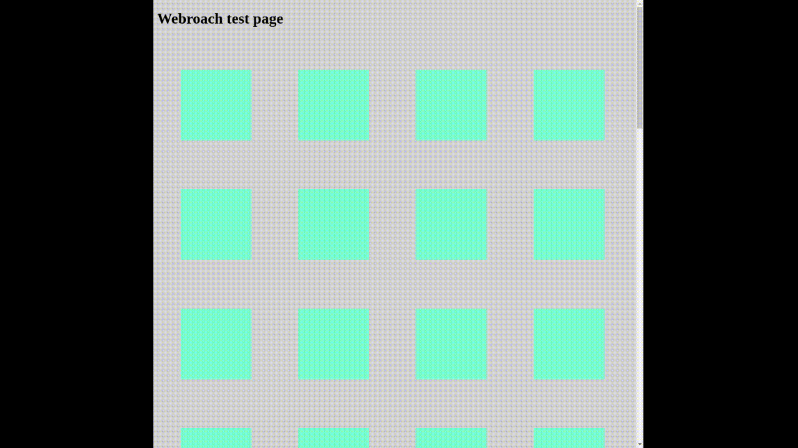

# webroach - xroach for the web

The web version of the classic linux productivity tool [xroach](https://github.com/interkosmos/xroach/). 
Cockroaches will scamper around the page until they
find an image to hide behind.

## Add roaches to your webpage

To use the webroach-library, you can download `roaches.js` and add the
following lines to the `<head>` section of your page:

```html
    <script src="roaches.js"></script>
    <script>
        window.onload = () => {
            roachesAreGo(10);
        };
    </script>
```

The first parameter of `roachesAreGo()` is the number of roaches to add to the page. 
An optional second parameter controls the speed of the roaches, the default is **20**.

## Demo

In the `/demo` directory of this repo, you can find a demo page showing the roaches
in action. Clone the repo to check it out, it should look a bit like this: 




## Copyright

Original copyright 1991 by J. T. Anderson.

I used the roach images from the [interkosmos/xroach](https://github.com/interkosmos/xroach)
repository, which seems to be a modernization of the original code.

## Known limitations

- roaches are not visible when behind an opaque non-image element
- roaches will only hide behind images, no other DOM elements are considered for cover
